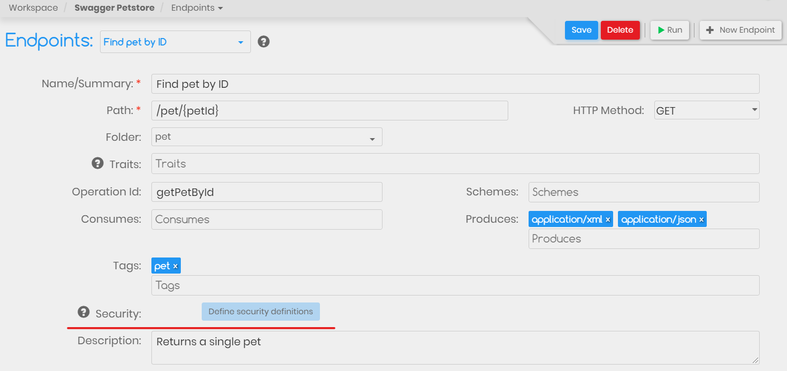

# APIC CI/CD Integration \(with Jenkins\)

We understand how difficult it gets to automate API testing. With a little help from APIC you can reuse your Test Suites created in APIC to automate your API testing. Integrate [APIC \(apic-cli\)](https://github.com/apic-apps/apic-cli) with your CI/CD pipeline in few steps and every time you push new code or deploy a new build in one of your environments, APIC will run your Test Suites automatically.

#### apic-cli

[apic-cli](https://www.npmjs.com/package/apic-cli) is a command line utility that allows you to test your Test Suits created with apic from a command line or with a node js app. With the help of apic-cli you can run your API test suites from inside your Continuous Integration / Continuous Deployment \(CI/CD\) environments.

### apic-cli integration with Jenkins

#### 1. Installation

[Follow the Steps here](https://jenkins.io/doc/book/installing/) to install Jenkins.

[Follow the steps specified here](apic-command-line-interface-apic-cli.md) to install apic-cli

#### 2. Getting your API Test Suite Ready

Now make sure you have [created a Test Suite](tester/creating-test-suits.md) created for your APIs and have added test cases to each API requests either [using the Test Builder](tester/using-test-builder.md) or by [writing the test cases](tester/writing-test-cases.md) yourself using Chai.js

For now lets use the example test suite **ToDo Demo** that comes pre-loaded with APIC.

Run the Test Suite within APIC to make sure all the test cases are passing.


#### 3. Export your Test Suite

You can export your Test Suite by selection the **Export Suite** option from the left menu. If you have used any environment variables in your project then make sure you export the environment too.

Alternatively you can export your Test Suite and Environment together in a single file by selecting **Export with Environments** option from the left menu.



#### 4. Running your API Test Suite with apic-cli

You can run your exported test Suite with apic-cli as `apic-cli run|r <pathTo/suit> -e <pathTo/environment>`

For example if you have exported the apic **ToDO demo** Suite and its environment together the you can run it as 

```javascript
apic-cli run ".\example\ToDo demo-with-env.suit.apic" -r cli,junit
```

Or if you hae exported them separately into separate files then run it as 

```javascript
apic-cli run ".\example\ToDo demo.suit.apic" -e ".\example\APIC Todo demo-env.env.apic" -r cli,junit -d
```

For more option on running a Test Suite [refer the section here](apic-command-line-interface-apic-cli.md).

#### 5. Integrating with Jenkins

#### 


