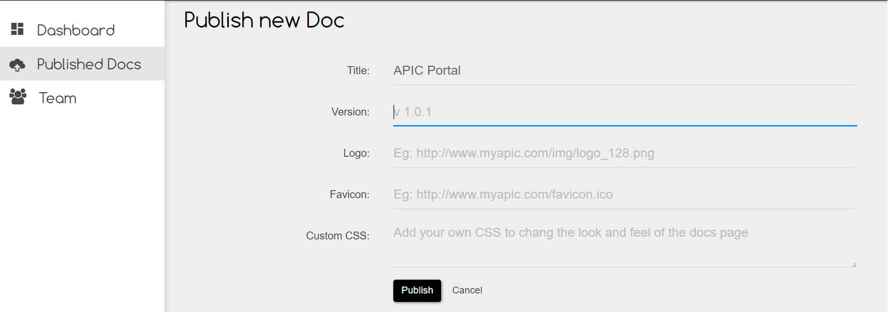

# Published Docs

APIC's API designer allows you to beautifully design the structure of your APIs. This is then used by APIC's Docs tool to generate stylish functional documents. Now if you want other third party developers on board with your APIs then you can share this documentation online by publishing it with APIC.

Once you have published a doc, you will get a URL that points to your published docs which you can share with others by linking to it from your website. Soon we will be adding the support to host it on your own domain.

## Publish a Doc

To publish a doc, open the desired project in the Designer module and click on the publish button in the project header section as shown below.

Once you click on publish you will be taken to the Published Docs section under Dashboard where you can specify the version, URL of your logo, favicon etc. If the styles used for the docs does't suite you then you can override them by adding your own CSS here. Once done click on **Publish** which will publish the docs online and generate the URL for it.

## Republishing a Doc

If you have updated your API specs and want to update your published docs then you need to republish it. You can do that from 2 places. Firstly when you open the PAI project under designer you should see a RePublish button clicking whic will take you to the republish screen.

Alternatively you can navigate to Dashboard section and select Published Docs from the left menu which will present you with a list of all your published docs. To update/republish it click on the Pencil icon beside it which will open the edit view.

Now you can bump up your doc's version and republish it. Republishing will take your latest API specs from the designer and rebuild the docs for you.

## Viewing a Published Doc

You can view your published doc by clicking on the `View Doc` button either from the Project home page in `Designer`section or beside the project in the projects list shown under`Published Doc` section under `Dashboard`.

## Deleting a Published Doc

You can delete your published docs by clicking on the thrash icon beside the project in the projects list shown under Published Doc section as shown in the previous image.

