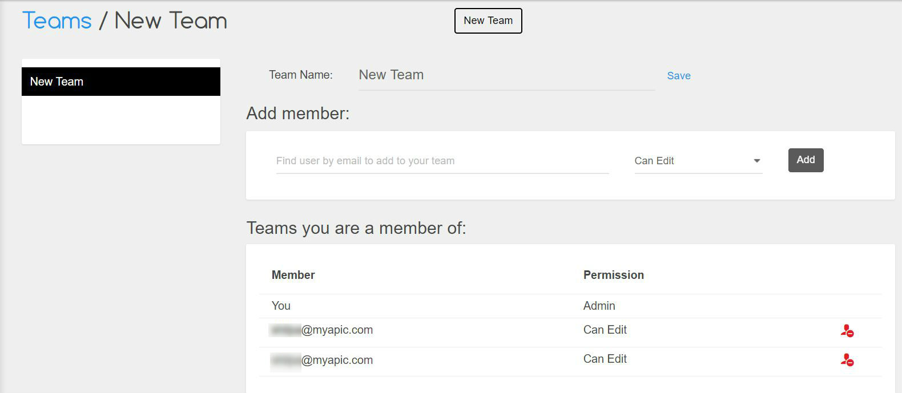

# Team Management

APIC allows seamless sharing of API projects, Requests, TestSuites etc with others by creating teams. Once Dashboard is opened click on the Teams option in the left menu to access you Team management console.

You can see your existing teams here as well as the list of teams you are a member of.

## Creating a Team

To create a new team click on the `New Team` button present on the top of the team summary page, give an awesome name for your team and click `Create`. Now you can add members to the team and share stuff with them.

## Adding/Removing Team members

You can add or remove a member from your team from the details view of the team. To do so click on the **pencil icon** or **add member icon** beside your team which will open the detail view of the team. You can also change the name of your team here.

To add a member enter the email id of the user in the add member section, select permission type and click add. If the user is already registered with APIC then he/she will be directly added as a member in your team. Other wise APIC can invite your friends/coleagues by sending them an email.

You can remove a team member by clicking on the thrash icon beside the member in the Team members list as shown below

## Deleting a team

You can delete a team by clicking on the thrash icon beside the team in the list of teams shown above. Once you delete a team all the stuff \(APIProjects, Requests, Test Suites etc\) you have shared with the members will be removed from their APIC's environment.

## Existing a team

If you don't want to be a member of a team any more then you can leave the team by clicking on the Exit Team button shown in the **Members of Team** list. Once you leave a team you will loose everything that has been shared with you as a member of that team.

## What's next?

Do you know you can generate beautiful functional documentation for your API project with APIC and also share it with third-party developers. APIC's `Published Docs` allow you to publish the documentation online for other third-party developers whome you want to get on board for using your PAIs.

