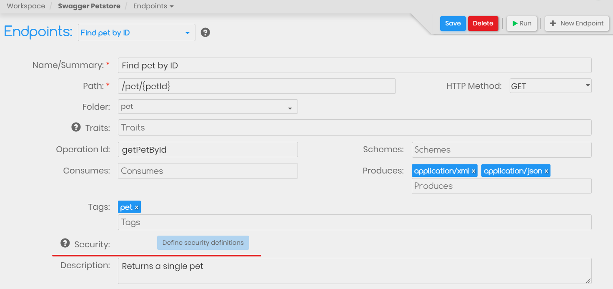

# API Security Definitions

## Defining Security Definitions

You can specify different Security Definitions for your APIs while designing your API in the designer section. This adheres to the **securityDefinitions** property of the Swagger specification. To define the security definitions navigate to your API projects home and open the **Security** section as shown below.


You can select following type of security definitions as supported by Swagger specifications.

1. **basic -** Basic Authentication using a username and password
2. **apiKey** - Authentication via an api key by passing it either via header or query param.
3. **oauth2** - OAuth 2.0

## Using Security Definitions

Once the security definition are defined you can start adding them in the [Endpoint designer section](create-endpoint.md). By default no security definitions are applied to any endpoint. Click on the **Define Security Definitions** button to add an security as shown below. Similarly any added security definitions can be removed by clicking on the **Remove Security Definitions**. 



Once a specific type of Security definitions is selected for an endpoint, APIC will use this information to auto populate the respective header/query parameters during testing.

### basic

For example if you have added a security definitions of type **basic** then while [running the request](../tester/make-an-api-call.md) in the tester section APIC will automatically add the following Header.

```jsx
Authorization: {{apic.basicAuth(basicAuthUser, basicAuthPassword)}}
```

Just populate the `basicAuthUser` and `basicAuthPassword` [environment variable](../tester/managing-environments.md) and APIC will automatically add the Authorization header to your request.

### apicKey

Similarly if you select **apiKey** type of security for an request then apic will add the following header or query parameter to your request while testing it via the [Tester module](../tester/).

```jsx
<header_name>: {{apiKey}} //if in: header
or
<query_param_name>: {{apiKey}} //if in: query
```

