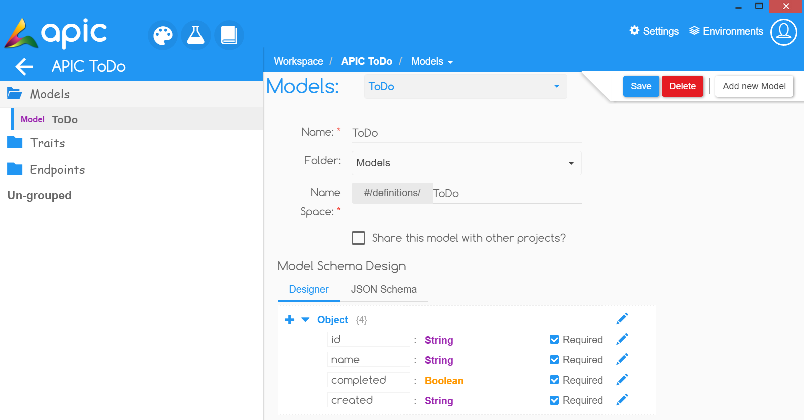

# Creating a Model or Definitions

Have a schema that you want to reuse in multiple places? Create a Model. Models represent schema objects that allow the definition of input and output data types. Should be used to reduce duplication. Models can be reused with in another models, in traits or with endpoints. Use $ref to refer an existing model. Models are exactly like **`definitions`** as specified by **Swagger.**

You can create a Model by clicking on the Models option in your Project Home page which will open a view as shown below to fill in the details and create your Model.

## Example

Lets create a ToDo modes with the **schema** shown above and we will put it under **Models** folder.

## What's next?

Next we will [create some generic response patterns or traits](create-trait.md).

