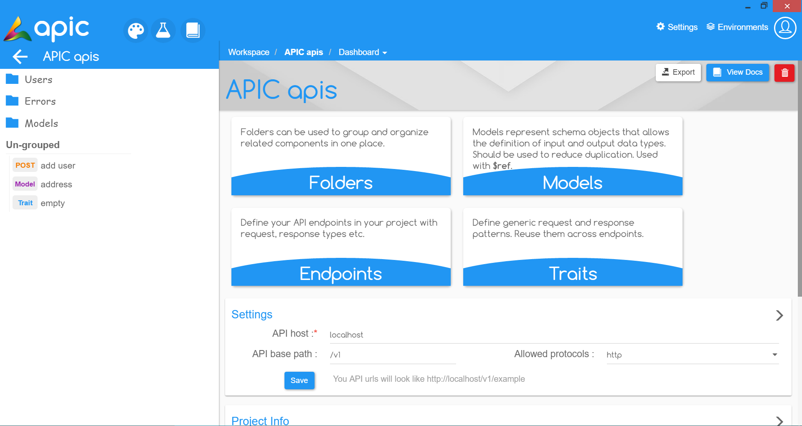

# Working with API project

To start building your API select it from the designer workspace and you will be presented with a set of options where you can

* [Define your project settings](working-with-api-design.md#proj-setting)
* [Create Folders](create-folder.md)
* [Create Models](create-model.md)
* [Create Traits](create-trait.md)
* [Create API Endpoints](create-endpoint.md)
* [Export and view Docs](export-docs.md)

## Project Setting 

You can set some basic information about your project like **API host name**, **API base path** and **Allowed protocols**, under the Settings panel in your projects home screen.

## [**Create Folders**](create-folder.md) 

Folders can be used to group and organize related components in one place.

## [Create Models](create-model.md) 

Have a schema that you want to reuse in multiple places? Create a Model. Models represent schema objects that allow the definition of input and output data types. Should be used to reduce duplication. Models can be reused with other models, in traits or with endpoints. Use $ref to refer an existing model.

## [Create Traits](create-trait.md) 

Traits will help you to define generic request and response patterns like query parameters, headers, response types \(200, 404\) ect and their respective response schemas. You can reuse them with endpoints.

## [Create Endpoints](create-endpoint.md) 

Endpoinst are your actual APIs.You can define your API endpoints in your project with request, response types, response schemas etc.

## What's next?

Next we will design APIs for a ToDo Application. But first let's get organized by [creating a folder](create-folder.md).

