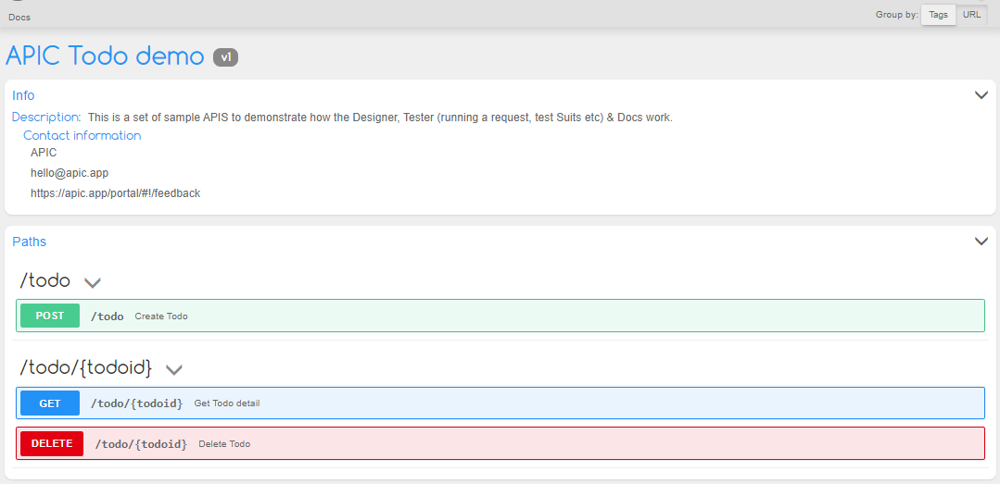

# API Documentation

APIC can convert your APIs designs into beautiful functional documentations that will help others to get on board faster. To generate the docs for you API design go to **Docs** module from the top menus or if you are in the Home Screen of your API project then you can click on the Docs button in the header.

