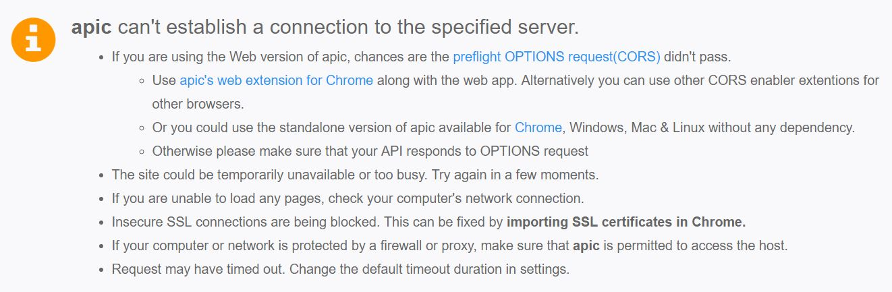
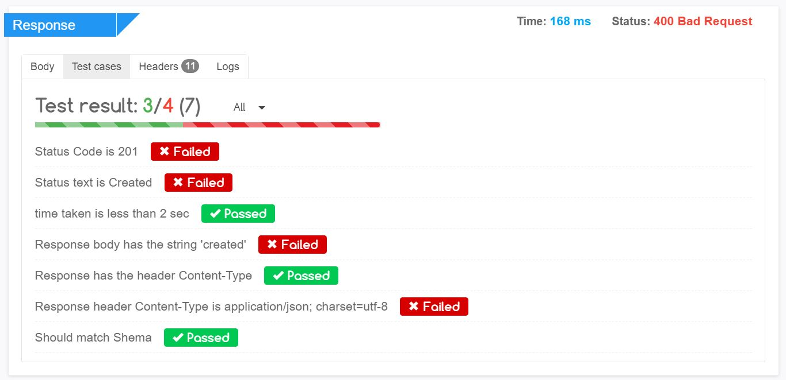

# Viewing API Response

Once the request is complete you can see the response in the **Response panel** of the tab. If you dont see the Response panel the the API request might have failed and you should see an error message like this. 

## Body

If a response is returned by the server then you can see under the **Body** tab in the **Response panel**. You can also see the **Status Code** & **Status Text** for the response along with the **Time taken** for the request to complete at the top right corner of the Response panel. Under Body tab there are 3 different tabs to see your response.

1. **Pretty -** Formats and beautifies the response to make it more user readable.
2. **Raw -** Shows the response as it is received from the server
3. **Preview -** If the returned response has html content or is a image/audio/video the you can preview it under this tab
4. [**Test Builder**:](using-test-builder.md) Provides an feature rich UI to build Tests based on your response

   

## Headers

You can see the headers returned by the server under **Headers** tab.


## Test Cases

You can add test cases to your API before running it under the **Scripts** tab before making a request. Once a response is received your test cases will be executed and results will be shown in the **Test Cases** tab in the Response panel. By default it will show all test results. To see only Passed or Failed results you can use the filter beside the results. Learn [how to add Test Cases](writing-test-cases.md) and [perform end to end testing of your APIs](creating-test-suits.md).

Ex:

```javascript
apic.test("Check that Status code is 201 (Created)", function(){
    expect($response.status).to.be.eql(201);
});
apic.test("Status Text is Created", function(){
    expect($response.statusText).to.be.eql("Created");
});
apic.test("Time taken is less than or equals to 2 sec", function(){
    expect($response.timeTaken).to.be.lte(2000);
})
apic.test("Response raw body contains string 'your_string'", function(){
    expect($response.body).to.include("your_string");
});
apic.test("The value of response header Content-Type is application/json", function(){
    expect($response.headers.getValue("content-Type")).to.be.eql("application/json");
});
```

The same code above can also be written as:



## Logs

Apic allows you to debug your test scripts by logging your variables. If you want to debug some values in your script the you can do that by adding logs. All your added logs will be shown in the **Logs** tab

Ex

```javascript
//To see the value of status code
log("Status code is: " + $response.status);

//to see the value of a specific header
log("Value for header Content-Type: " + $response.headers.getValue("content-Type"));

// to see the raw response 
log($response.body);

/*if your response is a JSON data then you can access individual fields in your response
    {
    "errCode":400,
    "msg": "Missing todo name"
    }
*/
// for the above response you can access the msg & errCode property by using
log($response.data.msg);
log($response.data.errCode);
```


## Next: [Managing Environments](managing-environments.md)

