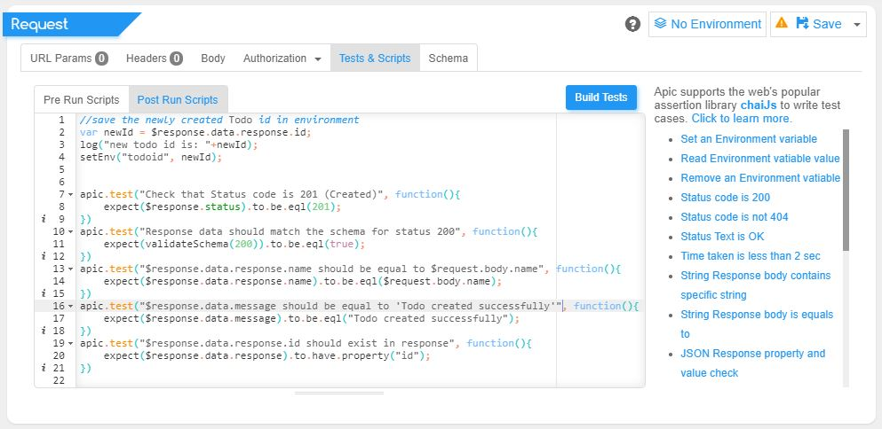

# Writing Test Cases

## Writing Tests for your API  with **apic**

With apic you not only can you run APIs and view response but also test them by adding test cases for the APIs. You can add test cases to your requests under the Scripts tab in the Request panel. You can add 2 types of scripts; pre-run script which is executed before the request is made and post-run script which is executes after the response is received.



**JavaScript** is used to write test cases for apic. You can use the popular javascript assertion library [**chaiJs**](https://www.chaijs.com/) to write your tests. Apic provides a wide range of API functions to prepare your test cases. See the entire list of functions available in the sections below.

Use apic.test\(\) to write a test which takes 2 arguments, the first one being the name of the test and the second one a function that contains your assertion logic. If the code inside the test function thorws an error/exception then the test is considered to have failed. Otherwise apic considers the test to be passed. Thats how the assertion in chaiJs works.

For example let's say you want to test if the response has a field `id` with the value of say `123456`. Here is what your test would look like:

```javascript
apic.test('Response should have a field id with value 123456', function(){
    expect($response.data).to.have.property("id").and.to.be.equal('123456')
})
```

## Apic test APIs and Functions

Apic provides a set of APIs and functions to automate the process of API testing. For example checking the status code, checking if a header is present in the response or not etc.

### The response object \($response\)

To test the response and its properties, apic creates a response object named `$response` that has below properties.

* `$response {object}` - This is the main response object which is created when the run is complete.
  * `body {string}` - The raw string response data received in the response.
  * `data {object}` - If the response can be converted to JSON then apic converts it to a JSON object and stores it under the data property of `$response`. If the response cant be converted to JSON then `$response.data` will be `undefined`. If the API response looks like `{"msg":"Todo created", "id":"1oFrKEGzoSX2raFHR8xR", "name":"SEo378VnqzdVsCF"}` then you can access `name` by using `$response.data.name` in your scripts. Same for `$response.data.id` and `$response.data.msg`.
  * `headers {object}` - `$response.headers` object holds the list of all headers received in the response as properties and header values as the values for the properties. For example to get the value of Content-Type use `$response.headers['Content-Type']`.
  * `headersStr {string}` - The raw string of headers received in the response \(by default headers are received as a string separated with '\n'\).
  * `status {number}` - The http status code for the response. Ex: 200, 404.
  * `statusText {string}` - The http status text for the response. Ex OK, Not found
  * `timeTaken {number}` - Time taken for the request to complete in milliseconds.

### The request object \($request\)

You can access the details of the request that was sent by using the `$request` variable in your tests. For example the final request url \(`$request.url`\) or the value of a request body \(`$request.body.todoName`\)

* `$request {object}` - The object containing information about the request.
  * `url {string}` - This is the final URL to which the request was sent.
  * `method {string}` - The HTTP method used to send the request.
  * `heather {object}` - An object containing information about the headers that were sent in the request. For exaample if your request have an `authorization` header the you can access the value for that in the test with `$request.headers['authorization']`
  * `query {object}` - An object containing query parameters sent in the request
  * `body {object/string}` - If your request has a payload body then you can acces that by using `$request.body` in your scripts.
    * **JSON body** - If your request payload is a JSON object the apic will automatically convert it to a JSON object and add it to the `$request.body` object
    * **String body** - If your request payload can't be converted to a JSON then `$request.body` will be a string.
    * **form-data/x-www-form-urlencoded** - If you used form-data/x-www-form-urlencoded to send your payload then they will also be converted to an object and added to body. For example if you send a form data as `name=abcd` then `$request.body` will be an object with value `{name: "abcd"}`

### Response Schema validation

You can use `validateSchema()` in yout test scripts to validate if the response is adhering to the specified schema or not. [Know more about apic schema validation at https://apic.app/docs/tester/response-schema-validation.html](https://apic.app/docs/tester/response-schema-validation.html)

Examples:

```javascript
apic.test("The created ToDo name should match to the one sent in request.", function(){
    expect($response.data.name).to.be.eql($request.body.name);
});

apic.test("Check that Status code is 201 (Created)", function(){
    expect($response.status).to.be.eql(201);
});

apic.test("Response data should match the schema for status 200", function(){
    expect(validateSchema(200)).to.be.eql(true);
});

apic.test("$response.data.message should be equal to \"Todo created successfully\"", function(){
    expect($response.data.message).to.be.eql("Todo created successfully");
});

apic.test("$response.data.response.id should exist in response", function(){
    expect($response.data.response).to.have.property("id");
})
```

### Dynamic data functions <a id="data-function"></a>

Sometimes you may need to send dynamic random data while making API calls. We have got you covered. Apic provides a set of functions that you can use while making requests to generate dynamic random data.

* `apic.randomStr(minLength/length, maxLength)` - returns a random string with length between `minLength` and `maxLength` .If maxLength is not specified the the returned string is exactly of length `minLength`. If neither is specified, default 1 character string.
* `apic.randomNum(min, max, isFloat)` - generates a random integer number between the min and max value. Sending the third argument isFloat as true will return float/decimal number.
* `apic.randomEmail()` - generates valid random email id.
* `apic.randomInList(list)` - if you want some random values from a list then you can use this function. This will accept a list of anything and will return one entry from the list randomly. Ex: `apic.randomInList([1, 2, 1.111, 'some text', 'etc..'])`.
* `apic.time()`  - returns the current timestamp

#### Additional functions

* `Object.has(property, strictMode)` - This function can be called on any Object to check if the specified property exists in the object ot not. Returns `true` or `false`.  By default the check is done by ignoring the case of the property. If you want to make the check case sensitive pass the second argument `strictMode` as `true`. This can be useful to check if a specific header is present in the response or not

Ex:

```javascript
var obj = {
    "name":"user name",
    "age":22
}

obj.has("name");  //true
obj.has("Name"); //true
obj.has("Name", true) // false, in strict mode property name are case sensitive

//check if response has specific Header
apic.test("Response has header content-type", function(){
    $response.headers.has("Content-Type")
})
```

* `Object.getValue(property, strictMode)` - This function can be called on any Object to get the value of a specific property. By defaulte value is retrived by ignoring the case but to force case sensitive check send the second parameter striceMode as true. This can be useful to het the value of any specific header or getting values from the response data.

Ex:

```javascript
var obj = {
    "name":"user name",
    "age":22
}

obj.getValue('age'); //22
obj.getValue('AGe'); //22
obj.getValue('AGe', true); //undefined

//get the value of content-type header
apic.test("Response header Content-Type is application/json", function(){
    expect($response.headers.getValue("content-Type")).to.be.equal("application/json");
})
```

